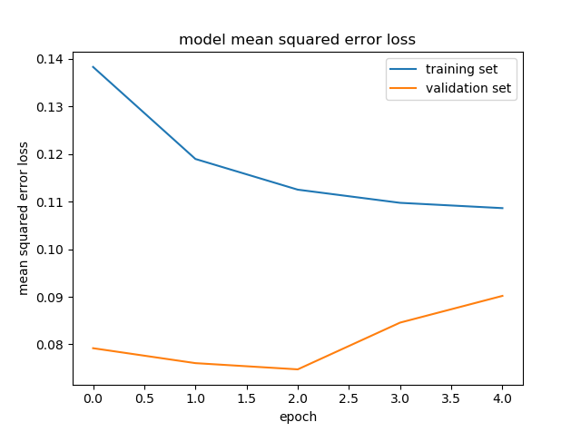

# Behavioral Cloning Project

[](http://www.udacity.com/drive)

## Overview

In this project, I used what I've learned about deep neural networks and convolutional neural networks to clone driving behavior. I trained, validated and test a model using Keras. The model will output a steering angle to an autonomous vehicle.

Udacity has provided a simulator where I can steer a car around a track for data collection. I used image data and steering angles to train a neural network and then used this model to drive the car autonomously around the track.

The goals / steps of this project are the following:

* Use the simulator to collect data of good driving behavior
* Build, a convolution neural network in Keras that predicts steering angles from images
* Train and validate the model with a training and validation set
* Test that the model successfully drives around track one without leaving the road
* Summarize the results with a written report

## Result

[](http://www.youtube.com/watch?v=4nhp9Cc68fQ "Behavioral Cloning")

Here is a short video to show my result on the "Challenge Track".

## Reflection

### Files Submitted & Code Quality

My project includes the following files:
* model.py containing the script to create and train the model for track 1
* model_2.py containing the script to create and train the model for track 2
* drive.py for driving the car in autonomous mode
* model.h5 containing a trained convolution neural network for track 1
* model_2.h5 containing a trained convolution neural network for track 2 
* writeup_report.md or writeup_report.pdf summarizing the results


Using the Udacity provided simulator and my drive.py file, the car can be driven autonomously around the track 1 by executing 
```sh
python drive.py model.h5
```

... and the track 2 by executing
```sh
python drive.py model_2.h5
```
In the following writeup I will only write about the model for track 1, since the principle of both models for both tracks is the same.


The model.py file contains the code for training and saving the convolution neural network. The files shows the pipeline I used for training and validating the model, and it contains comments to explain how the code works.

### Model Architecture and Training Strategy

#### 1. An appropriate model architecture has been employed

My model consists of a convolution neural network with 5x5 filter sizes and depths between 24 and 64 (model.py lines 80-92) 

The model includes RELU layers to introduce nonlinearity (code line 80-84), and the data is normalized in the model using a Keras lambda layer (code line 76). 

#### 2. Attempts to reduce overfitting in the model

The model contains dropout layers in order to reduce overfitting (model.py lines 87, 89, 91). 

The model was trained and validated on different data sets to ensure that the model was not overfitting. The model was tested by running it through the simulator and ensuring that the vehicle could stay on the track.

#### 3. Model parameter tuning

The model used an adam optimizer, so the learning rate was not tuned manually (model.py line 108).

#### 4. Appropriate training data

Training data was chosen to keep the vehicle driving on the road. I used a combination of center lane driving, recovering from the left and right sides of the road.

For details about how I created the training data, see the next section. 

### Model Architecture and Training Strategy

#### 1. Solution Design Approach

As the first step I selected the NVIDIA CNN architecture for autonomous driving, since this architecture was already tested as effective.

In order to gauge how well the model was working, I split my image and steering angle data into a training and validation set. I found that my first model had a low mean squared error both on the training set and the validation set. This implied that the model was good. 

Then I tried to run the simulator to see how well the car was driving around track one. Most of time the vehicle drove well, but on the bridge the vehicle didn't know how to deal with the left brick side, to improve the driving behavior in these cases, I collected more data with driving specifically on the bridge.

At the end of the process, the vehicle is able to drive autonomously around the track without leaving the road.

#### 2. Final Model Architecture

The final model architecture is the NVIDIA CNN architecture for autonomous driving (model.py lines 80-92). It consists of 9 layers, including a normalization layer, 5 convolutional layers, and 3 fully connected layers.


#### 3. Creation of the Training Set & Training Process

To capture good driving behavior, I first recorded two laps on track one using center lane driving. 

I then recorded the vehicle recovering from the left side and right sides of the road back to center so that the vehicle would learn to deal with the sides. 

Then I repeated this process with driving reversely in order to get more data points.

To augment the data sat, I also flipped images and angles thinking that this would make the training data richer and the trained model more robust.

After the collection process, I had 6298 number of data points. I then preprocessed this data by normalizing the data and cropping the data.


I finally randomly shuffled the data set and put 20% of the data into a validation set. 

I used this training data for training the model. The validation set helped determine if the model was over or under fitting. The ideal number of epochs was 5. I used an adam optimizer so that manually training the learning rate wasn't necessary.

